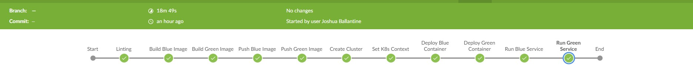
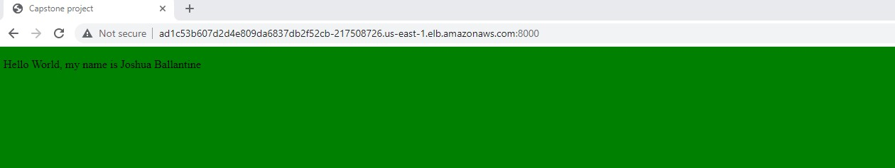
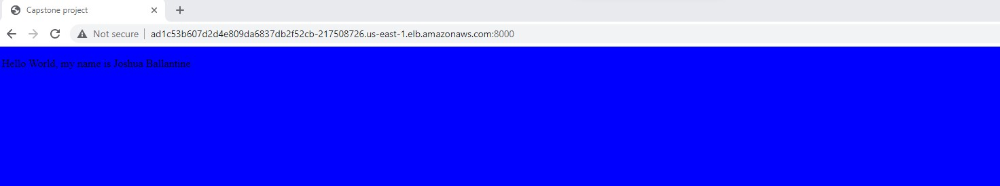

# Udacity DevOps Cloud Engineer Capstone Project


## Objectives

- Working in AWS
- Using Jenkins or Circle CI to implement Continuous Integration and Continuous Deployment
- Building pipelines
- Working with Ansible and CloudFormation to deploy clusters
- Building Kubernetes clusters
- Building Docker containers in pipelines


## Prerequisites

All tools required for this project are listed below. I have also set up an [EC2 instance](screenshots/ec2Inst.jpg) which will host/communicate with these tools and essentially serve as the management centre for this project.
- Jenkins (incl. Blue Ocean plugin)
https://www.digitalocean.com/community/tutorials/how-to-install-jenkins-on-ubuntu-22-04
- Docker
https://www.digitalocean.com/community/tutorials/how-to-install-and-use-docker-on-ubuntu-18-04
- Kubernetes
https://docs.aws.amazon.com/eks/latest/userguide/install-kubectl.html
- EKS
https://docs.aws.amazon.com/eks/latest/userguide/eksctl.html
- AWS/AWS-CLI
https://docs.aws.amazon.com/cli/latest/userguide/getting-started-install.html
- Github
To integrate with Jenkins https://www.cprime.com/resources/blog/how-to-integrate-jenkins-github/
- Hadolint
https://stackoverflow.com/questions/62369711/how-to-install-hadolint-on-ubuntu
- Tidy
```sudo apt install tidy```
- Bash


## Application Specification

A simple Nginx "Hello World" application defined [here](k8s/blue/index.html) and [here](k8s/green/index.html). The webpage will have a blue or green background depending on how the load balancer is configured.

## CI/CD Pipeline



### Stage 1 - Linting

My linting stage contains two jobs: linting the docker file using hadolint and linting the html using tidy. A successful linting job is shown [here](screenshots/lintingSuccess.jpg). A failed linting job is shown [here](screenshots/lintingFailure.jpg) and can be triggered by adding some erroneous syntax to the docker file or html file.

### Stage 2 & 3 - Build Blue/Green Image

This is done by calling the [run_docker.sh](scripts/run_docker.sh) script from the blue/green folder with the tag name as the argument.

### Stage 4 & 5 - Push Blue/Green Image

This is done by calling the [upload_docker.sh](scripts/upload_docker.sh) script from the blue/green folder with the tag name, docker username and docker password respectively as the 3 arguments. Proof of a successful upload to the docker hub is shown [here](screenshots/dockerUpload.jpg). Also note that for these stages rely on docker [credential configuration](screenshots/jenkinsCreds.jpg) within jenkins.

### Stage 6 - Create Cluster

Deploys the cluster using EKS and cloud formation. This stage (and the remaining stages) rely on aws [credential configuration](screenshots/jenkinsCreds.jpg) within jenkins. The cluster status is shown [here](screenshots/eksCluster.jpg) and the status of the pods are shown [here](screenshots/k8Resources.jpg).

### Stage 7 - Set K8s Context

Updates kubeconfig and configures kubectl from AWS EKS as shown [here](screenshots/configK8s.jpg).

### Stage 8 & 9 - Deploy Blue/Green Container

Deploys a container using the docker image with tag=blue or tag=green. Replication controller status is shown [here](screenshots/k8Resources.jpg). Jenkins console output for these steps is shown [here](screenshots/deployBlue.jpg) and [here](screenshots/deployGreen.jpg).

### Stage 10 & 11 - Run Blue/Green Service

Starts the blue/green service on the worker nodes. Status of services are shown [here](screenshots/k8Resources.jpg).


## Testing Application

The application can be tested by using the DNS Name and Port the load balancer is running on - this information is shown [here](screenshots/loadBalancer.jpg). The last stage of the Jenkins pipeline is to run the green service so we can see the "Hello World" text with the green background in the web browser.

This can be easily switched back to the blue version by running the "Run Blue Service" command.
```
kubectl apply -f ./k8s/blue/blue-controller.json
```


